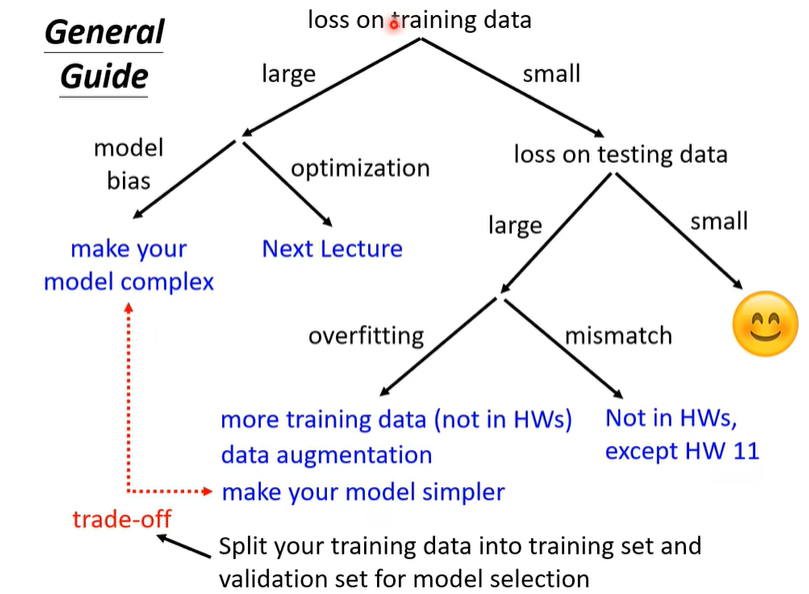
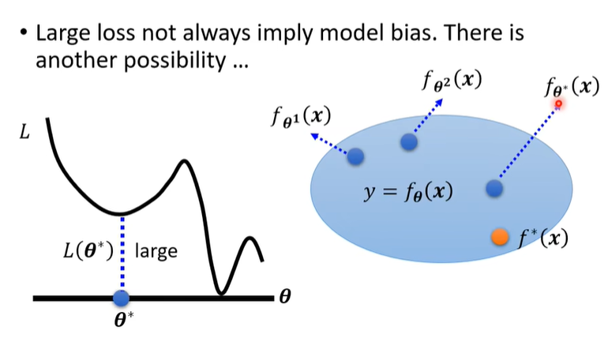

## Framework of ML

- Training Data
- Function Set with unknown parameters
- Goodness of Fit
- Optimization
- Test Data
- Prediction

## Training Loss is large

### Model Bias

所有模型的集合的性能都非常差，表示模型的设计太简单了

### Optimization Issue

from Residual Network, the deep model can not be trained well

## Training Loss is Small but Test Loss is Large

更加有弹性的、复杂的模型，可以在训练集上表现的非常好，但是在测试集上表现的非常差

Solution：

1. 增加更多的训练资料
2. Data Augmentation（需要合理的增强）
3. Constraint the model to be simple
   1. Less parameters
   2. Sharing parameters(CNN)
   3. Early stopping
   4. Regularization
   5. Dropout

但是我们需要在训练集上表现的好，同时在测试集上表现的好，我们需要进行权衡

### Mismatch

分布发生了变化，训练集和测试集的分布不一样

## Optimization Issue

### Local Minima, Saddle Point

GD只能找到梯度为0的点，但是这个点不一定是最优点，甚至不是局部最优点

可能为鞍点，我们可以通过泰勒展开来判断

$$
L(x) = L(x_0) + \nabla L(x_0)^T(x-x_0) + \frac{1}{2}(x-x_0)^T\nabla^2L(x_0)(x-x_0)
$$

使用GD，在训练过程中卡在Local Minima的概率非常小，但是卡在Saddle Point的概率非常大

因此我们需要使用更加复杂的优化方法，比如SGD、Momentum、Adam等

## Batch

小批次和大批次

- `batch_size=1`：每次只更新一个样本
- `batch_size=n`：每次更新n个样本
- `batch_size=All`：每次更新所有样本，计算所有样本的平均梯度

更大的批次有时候一个批次并不需要更多的时间，因为我们可以使用并行计算，不过可能因为瓶颈问题，导致计算时间变长

但是一个epoch，大的批次可能会更快，因为我们可以更快的计算梯度

但是小的批次会带来噪声，提供泛化性能，准确率更高

更神奇的是，同样性能的情况下，**小批次的模型在测试集上的性能比大批次的模型要好**

## Momentum

为梯度增加一个额外的惯性项，使得梯度更新更加平滑

- Vanilla GD

$$
\theta_{t+1} \gets \theta_t - \alpha g_t
$$

- GD + Momentum

从初始开始，参数为$\theta_0$，动量为$m_0=0$，计算梯度$g_t$，更新参数和动量

$$
m_{t+1} \gets \beta m_t + (1-\beta)g_t \\
\theta_{t+1} \gets \theta_t - \alpha m_{t+1}
$$