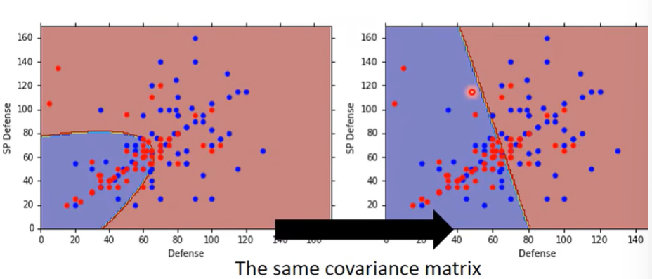
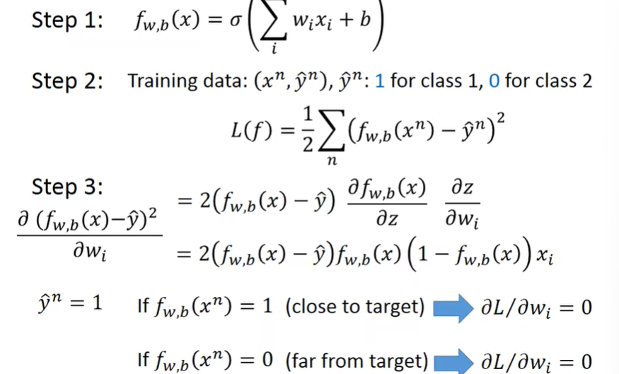

- Concepts of Machine Learning
- Concepts of Deep Learning

## Concepts of ML

除了 Supervised Learning, Unsupervised Learning, ML 仍然有很多非常广泛的任务，structure Learning

1. model: $f(x;\Theta)$用来描述一组函数族

2. loss: $L(\Theta)$用来描述一组参数的好坏，损失函数的选取决定了最终模型的选取

   - MSE
   - KL divergence

3. optimization: $\Theta^* = \arg\min_{\Theta} L(\Theta)$
   - Gradient Descent: $\Theta_{t+1} = \Theta_t - \eta \nabla L(\Theta_t)$参见最优化笔记，在指定迭代次数或者收敛条件下，找到最优解，但是 GD 最大的问题不是 Local minima
   - SGD
   - Adam

### Example

一个时序预测的例子，给定一个时序数据，预测未来的数据

比较经典的从 Linear Model 开始，然后到 Nonlinear Model

> 由模型选择带来的问题，叫做**Model Bias**: $bias = (\mathbb{E}[f(x;D)] - f(x))^2$

可以使用分段线性模型（例如 RELU）叠加来近似任意函数，这就是**Universal Approximation Theorem**

$$
curve = \text{const.} + \sum_{i=1}^n c \cdot \frac{1}{1 + \exp(-w_i \cdot x - b_i)}
$$

通过调整参数$c, w, b$可以拟合任意函数

分段线性模型有

- Sigmoid Function
- ReLU
- Tanh
- ...

因此实际上，我们可以通过叠加分段线性模型来拟合任意函数，形式为

$$
y = b + \sum_{i=1}^n c_i \cdot \sigma(b_i + \sum_{j=1}^m w_{ij} \cdot x_j)
$$

这就是神经网络的基本结构

$$
r = x W + b= \begin{bmatrix}
   x_1 & x_2 & x_3
\end{bmatrix}
\begin{bmatrix}
   w_{11} & w_{12} & w_{13} \\
   w_{21} & w_{22} & w_{23} \\
   w_{31} & w_{32} & w_{33}
\end{bmatrix} +
\begin{bmatrix}
   b_1 & b_2 & b_3
\end{bmatrix}
$$

$$
h = \sigma(r)
$$

$$
y = h W_{hy} + b_{hy}
$$

然而对于所有$N$个数据计算损失函数的梯度是非常耗时的，因此我们可以使用**Mini-batch**的方法，每次只计算一部分数据的梯度

### Structure

因此，Deep Learning 最核心的概念就是

- **Model** defined by **a set of functions**
- Loss function
- Optimization

## CLassfication

初始想法：Classfication 当作一个 Binary Regression 问题，即将类别转化为 0/1，然后使用 Linear Regression 的方法进行预测

- 类似于使用分类边界分类，但是受到离群点影响很大 

改正想法：使用符号函数，即将输出值映射到 0，1，损失函数使用不相等的个数

但是我们采用另一种方法，建模每一个类别的概率与给定类别，特定输入向量的发生概率，使用：

$$
P(C_1 | x) = \frac{P(x | C_1) P(C_1)}{P(x)} = \frac{P(x | C_1) P(C_1)}{\sum_{i=1}^n P(x | C_i) P(C_i)}
$$

因此我们需要建模 $P(x | C_i)$，即建模每一个类的数据条件概率密度函数

- 如果能够确定条件概率密度**函数形式**，那么就可以通过**最大似然估计**来估计参数
- 得到参数后，就可以通过贝叶斯公式来计算后验概率，即给定输入向量，计算每一个类别的概率，选择概率最大的类别作为输出

模型简化：假设每一个类别的条件概率密度函数都是**高斯分布**，同时每一个类别的高斯分布的协方差矩阵都是相同的（防止过拟合），即

$$
P(x | C_i) = \frac{1}{(2\pi)^{D/2} |\Sigma|^{1/2}} \exp\left(-\frac{1}{2} (x - \mu_i)^T \Sigma^{-1} (x - \mu_i)\right)
$$

最后得出的似然函数为**所有类别的似然函数的乘积**，微分后得到参数的估计值，可以发现这个函数的边界是线性的，但是准确率提高了很多

- Function Set: 贝叶斯公式 + 高斯分布
- Goodness of Fit: 似然函数
- Optimization: MLE

对概率分布的假设有很多种，比如

- 条件独立性
- 马尔科夫性
- 高斯分布
- 二项分布
- ...

对后验概率进行分析：

$$
P(C_1 | x) = \frac{P(x | C_1) P(C_1)}{P(x|C_1)P(C_1) + P(x|C_2)P(C_2)} = \frac{1}{1 + \frac{P(x|C_2)P(C_2)}{P(x|C_1)P(C_1)}}
$$

我们令$z=\log \frac{P(x|C_1)P(C_1)}{P(x|C_2)P(C_2)}$，则有

$$
P(C_1 | x) = \frac{1}{1 + \exp(-z)} = \sigma(z)
$$

$$
z = \log \frac{P(x|C_1)P(C_1)}{P(x|C_2)P(C_2)} = \log \frac{P(x|C_1)}{P(x|C_2)} + \log \frac{P(C_1)}{P(C_2)}
$$

将高斯分布，协方差相等和频率带入，得到，自行推导

最后推导的结果是一个线性项和一个与$x$的无关项的和，这就是**Logistic Regression**的基本形式

最后可以写成

$$
P(C_1 | x) = \sigma(w^T \cdot x + b)
$$

那么其实可以不需要以概率视角导入，我们直接对数据进行上述的后验分布的计算，然后直接进行分类，这就是**Logistic Regression**

- Function Set: Logistic Function
- Goodness of Fit: Likelihood -> Cross Entropy(Why not MSE?)
- Optimization: Gradient Descent

Why not Logistic Regression + Square Error?

### Discriminative vs Generative

两种方法对Function Set 的选取是相同的，但是假设不同（高斯分布 vs Logistic Function），最后得出的函数形式是不同的

因此，生成式模型有如下的优势

- 可以从少数据中学习
- 强假设赋予了鲁棒性
- 可以把先验和类别概率分开建模

### Multi-class Classification

$$
P(C_i | x) = \frac{\exp(w_i^T \cdot x)}{\sum_{j=1}^n \exp(w_j^T \cdot x)}
$$

同时如果有线性不可分的情况，可以加kernel，或者使用隐藏层映射到新的空间