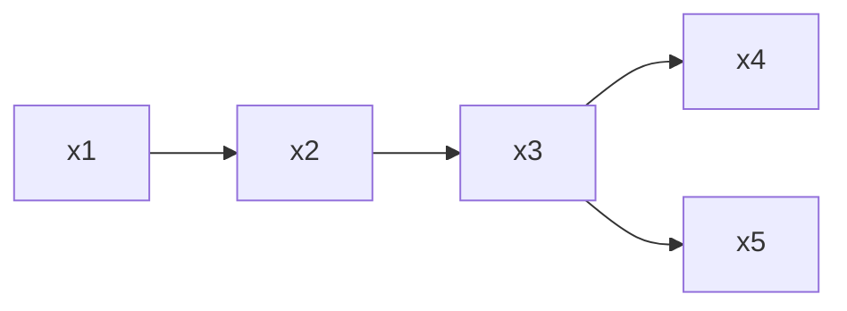

## 定义

概率图模型旨在将关系用图的形式表示出来，从而更好地理解变量之间的关系。概率图模型分为有向图模型和无向图模型。

**概率**：概率模型关心的是一个多维的概率分布

**图**：即图论的图，起的作用为一个工具，直观表达概率之间的联系，将概率嵌入图中，使得模型更加直观，可以将概率模型的特征明显表示出来。

生成式模型获得的联合概率分布$P(Y,R,O)$，要做推断，就要消去变量获得$P(Y | O)$，这个复杂度是难以接受的，同时在实际应用中，变量往往存在相互关系，这种关系可以用图表示出来，从而简化推断的过程。

有向：贝叶斯网络

无向：马尔科夫网络

## HMM 隐马尔科夫模型

是一种最简单的动态贝叶斯网络，使用齐次马尔可夫假设。

$$
P(x_n | x_{n-1}, x_{n-2}, \cdots, x_1) = P(x_n | x_{n-1})
$$


由因子分解（[请看概率图模型基础](https://www.cnblogs.com/Blackteaxx/p/18180183)），可得联合概率密度

$$
P(x_1, y_1, x_2, y_2, \cdots, x_n, y_n) = P(y_1) P(x_1 | y_1) \prod_{i=2}^n P(y_i | y_{i-1}) P(x_i | y_i)
$$

除去结构信息之外，HMM 还有三个参数$\lambda = [A, B, \pi]$, $A$为状态转移矩阵，$B$为输出观测矩阵，$\pi$为初始状态概率。

$$
A: | S | \times | S | \to \mathbb{R} \\
B: | S | \times | O | \to \mathbb{R}
$$

假设状态变量的取值为$S=\{s_1, \dots, s_n\}$，观测变量的取值为$O=\{o_1, \dots, o_m\}$，则有：

- 状态转移概率
  $$
  a_{ij} = p(y_{t+1}=s_j|y_t=s_i)
  $$
- 输出观测概率
  $$
  b_{jk} = p(x_t=o_k|y_t=s_j)
  $$
- 初始状态概率
  $$
  \pi^i_t = p(y_t=s_i)
  $$

我们可以得到$\pi_{t+1} = \pi_{t} \cdot A$

1. Evaluation Problem：给定模型$\lambda$和观测序列$O$，计算在模型$\lambda$下观测序列$O$出现的概率。一般使用前向算法或者后向算法计算。
2. Learning Problem：给定观测序列$O$，估计模型$\lambda$，使得在该模型下观测序列$O$出现的概率最大。一般使用 Baum-Welch/EM 算法进行估计。
3. Decoding Problem：给定模型$\lambda$和观测序列$O$，求解最有可能的状态序列$S$，即$S = \arg \max_S P(S|O;\lambda)$。
   1. 预测：$p(s_{t+1}|s_1, \dots, s_t)$
   2. 滤波：$p(s_t|o_1, \dots, o_t)$

例如在 Text-to-Speech 中，HMM 可以用来建模音素的序列，状态变量表示音素，观测变量表示音频信号，状态转移概率表示音素之间的转移概率，输出观测概率表示音素对应的音频信号的概率。

## MRF 马尔科夫随机场

无向图在因子分解时没有明确的方向性，因此要有额外的考虑

需要引入概念：

1. **团**：关于节点的集合，团中的节点形成一个完全图（所有的节点之间都有边）
2. **极大团**：团中不能再加入其他节点形成团(return 极大团是一个 NP-hard 问题)

**团分解**：将联合概率分解为多个团的势函数乘积

所有团的集合记为$C$, 与团$c$对应的变量集合$x_c$,势函数$\psi_c(x_c) \geq 0$

$$
p(x_1, \dots, x_p) = \frac{1}{Z} \prod_{c \in C} \psi_c(x_c)
$$

其中 Z 是归一化因子，使得概率和为 1,$Z = \sum_x \prod_{c \in C} \psi_c(x_c)$

_Mark: $\psi_c(x_c)$取值随着 x_c 中的 x 取值改变而改变_

然而，当变量个数较多时，团的数量会很多，因此需要简化，注意到团被极大团包含，因此可以使用极大团来简化。$C^*$为极大团的集合。

$$
p(x_1, \dots, x_p) = \frac{1}{Z} \prod_{c \in C^*} \psi_c(x_c)
$$

接下来的问题时如何构建势函数，使得因子分解与条件独立性一致。

根据 `Hammesley-Clifford` 定理，我们得知，如果联合概率分布能够使用极大团势函数表示，那么**因子分解与条件独立性的三个性质**等价。

- 全局马尔可夫性：给定两个随机变量集合的分离集，两个随机变量集合之间条件独立。
- 局部马尔可夫性：$a \perp (全集 - a - \text{neighbour of a}) | \text{neighbour of a}$
- 成对马尔可夫性：$x_i \perp x_j | x_{-i-j}$ 其中$x_i,x_j$不能相邻

也即

$$
\text{Global} \iff \text{Local} \iff \text{Pairwise} \iff \text{Maximal Clique Representation}
$$

势函数的构建通常要考虑变量集中的变量之间的关系，详见西瓜书。

## 推断

总体来讲，Inference 是指求解已知数据的概率，而求已知数据的概率时需要模型的参数，但是如果将参数看作未知的变量，那么学习的过程也可以被看作是 Inference 的过程。

Inference 主要分为两类：

1. $p(x_E)$
2. $p(x_F | x_E)$, 而 $p(x_F | x_E)$又可以被写作

$$
p(x_F | x_E) = \frac{p(x_F, x_E)}{p(x_E)}
$$

3. MAP: $\arg \max_{x_F} p(x_F | x_E)$

实际上 Inference 过程最主要的问题就是求解边缘分布的过程。

- 精确推断
  - 动态规划/变量消除/Variable Elimination
  - 信念传播/Belief Propagation
- 近似推断
  - 确定性近似：变分推断
  - 随机近似：MCMC

### Variable Elimination



$x_5$的边缘概率分布求解为

$$
P(x_5) = \sum_{x_1} \sum_{x_2} \sum_{x_3} \sum_{x_4} P(x_1, x_2, x_3, x_4, x_5)
$$

$$
= \sum_{x_1} \sum_{x_2} \sum_{x_3} \sum_{x_4} P(x_1) P(x_2 | x_1) P(x_3 | x_2) P(x_4 | x_3) P(x_5 | x_3) = \\
\sum_{x_3} P(x_5 | x_3) \sum_{x_4} P(x_4 | x_3) \sum_{x_2} P(x_3 | x_2) \sum_{x_1} P(x_2 | x_1) P(x_1)
$$

_曾经在 C 语言课上解释过最好先加再乘，因为乘法比加法慢_

可以定义中间函数，减少重复计算的结果：

$$
m_{12}(x_2) = \sum_{x_1} P(x_2 | x_1) P(x_1) \\
m_{23}(x_3) = \sum_{x_2} P(x_3 | x_2) m_{12}(x_2) \dots
$$

对于无向图，我们也可以使用 Variable Elimination 的方式进行推断。

$$
P(x_5) = \sum_{x_1} \sum_{x_2} \sum_{x_3} \sum_{x_4} P(x_1, x_2, x_3, x_4, x_5) \\
= \sum_{x_1} \sum_{x_2} \sum_{x_3} \sum_{x_4} \psi_1(x_1, x_2) \psi_2(x_2, x_3) \psi_3(x_3, x_4) \psi_4(x_3, x_5) \\
= \sum_{x_3} \psi_4(x_3, x_5) \sum_{x_4} \psi_3(x_3, x_4) \sum_{x_2} \psi_2(x_2, x_3) \sum_{x_1} \psi_1(x_1, x_2) = \\
\sum_{x_3} \psi_4(x_3, x_5) \sum_{x_4} \psi_3(x_3, x_4) m_{23}(x_3) \sum_{x_1} \psi_1(x_1, x_2) m_{12}(x_2)
$$

### Belief Propagation

对无向图进行推断，使用消息传递的方式，将消息传递给邻居节点。与上述过程类似


```{python}
for x_i in NB(x_j)
    collect message of x_i;
    send message to x_j;
```

就是图的遍历，对于无向图，我们可以使用这种方式进行推断。

### MCMC

主要思想：从一个 Markov Chain 中不断地采样，使得其平稳分布为我们要求的分布。

要让平稳分布满足我们的要求，我们需要一个平稳分布的必要条件

$$
P(x_{t}) T(x_{t-1} | x_t) = P(x_{t-1}) T(x_t | x_{t-1})
$$

我们利用拒绝采样的思想，构造一个提议分布$Q(x^\star | x^{t-1})$，然后通过构造一个接受率来使得满足以下条件：

$$
\alpha(x^\star | x^{t-1}) = \min \left(1, \frac{P(x^\star) Q(x^{t-1} | x^\star)}{P(x^{t-1}) Q(x^\star | x^{t-1})}\right)
$$

那么就满足了平稳分布的条件。

### Variational Inference

变分推断的思想是，我们不直接求解边缘分布，而是求解一个近似分布，使得近似分布与真实分布的 KL 散度最小。

这边省略

### LDA

