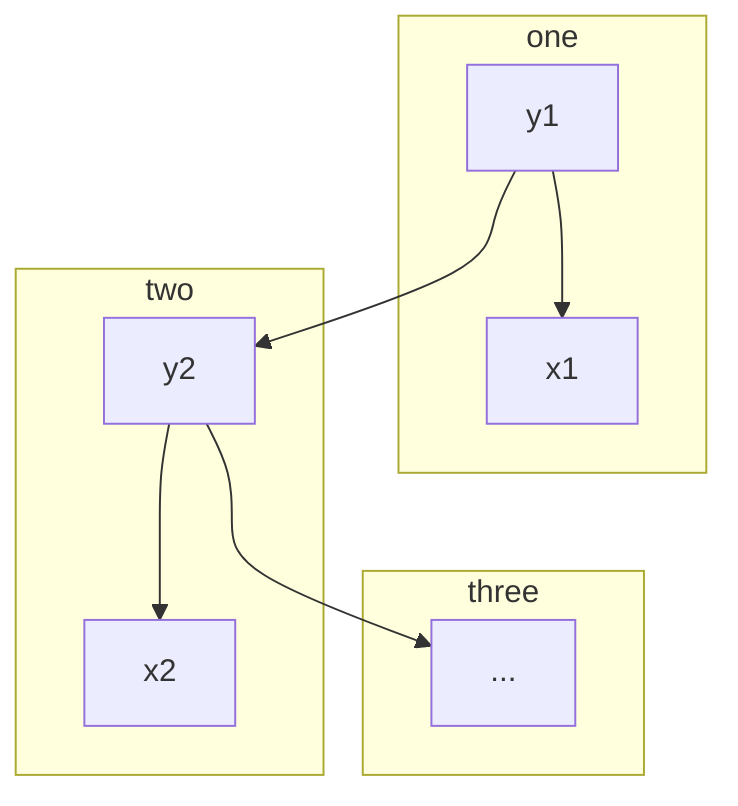

## 1. Background

频率派：定义 loss function 并进行优化
贝叶斯派：计算后验概率，使用数值积分的方式计算

## 2. HMM

HMM 是一个属于概率图模型中的动态模型(ref:[概率图模型](https://www.cnblogs.com/Blackteaxx/p/18180183))，并不要求数据是独立同分布的，又是一个混合模型

HMM 中的变量可以分为两组，一组为状态变量$y=\{y_1, \dots, y_n \}$，其中$y_i$表示第 i 时刻状态，一组为观测变量$x= \{x_1, \dots, x_n \}$，状态变量是隐藏的，观测变量是可见的，因此状态变量又被称作隐变量。

系统常在多个状态中转移，如果状态变量是离散的，那么 动态模型就为 HMM，如果状态变量是连续的，那么动态模型就是 Kalman Filter / Parlide filter。

根据概率图模型笔记中的因子分解，HMM 的联合概率分布可以写成：

$$
p(x,y) = p(y_1) p(x_1|y_1) \prod_{i=2}^n p(y_i|y_{i-1}) p(x_i|y_i)
$$

### 参数

除去结构信息之外，HMM 还有三个参数$\lambda = [A, B, \pi]$, $A$为状态转移矩阵，$B$为输出观测矩阵，$\pi$为初始状态概率。

$$
A: | S | \times | S | \to \mathbb{R} \\
B: | S | \times | O | \to \mathbb{R}
$$

假设状态变量的取值为$S=\{s_1, \dots, s_n\}$，观测变量的取值为$O=\{o_1, \dots, o_m\}$，则有：

- 状态转移概率
  $$
  a_{ij} = p(y_{t+1}=s_j|y_t=s_i)
  $$
- 输出观测概率
  $$
  b_{jk} = p(x_t=o_k|y_t=s_j)
  $$
- 初始状态概率
  $$
  \pi^i_t = p(y_t=s_i)
  $$

我们可以得到$\pi_{t+1} = \pi_{t} \cdot A$

### 两个假设

1. 齐次马尔科夫性假设(无后效性)：当前时刻的状态只与前一个时刻的状态有关，与其他时刻无关
   $p(s_t | x_1, \dots s_{t-1},s_{t+1},\dots, s_{p}) = p(s_t | s_{t-1})$
2. 观测独立性假设：当前时刻的观测只与当前时刻的状态有关，与其他时刻的状态和观测值无关
   $p(o_t|s_1,\dots,s_t,o_1,\dots, o_{t-1}) = p(o_t|s_t)$

### 三个问题

1. Evaluation Problem：给定模型$\lambda$和观测序列$O$，计算在模型$\lambda$下观测序列$O$出现的概率。一般使用前向算法或者后向算法计算。
2. Learning Problem：给定观测序列$O$，估计模型$\lambda$，使得在该模型下观测序列$O$出现的概率最大。一般使用 Baum-Welch/EM 算法进行估计。
3. Decoding Problem：给定模型$\lambda$和观测序列$O$，求解最有可能的状态序列$S$，即$S = \arg \max_S P(S|O;\lambda)$。
   1. 预测：$p(s_{t+1}|s_1, \dots, s_t)$
   2. 滤波：$p(s_t|o_1, \dots, o_t)$

例如在 Text-to-Speech 中，HMM 可以用来建模音素的序列，状态变量表示音素，观测变量表示音频信号，状态转移概率表示音素之间的转移概率，输出观测概率表示音素对应的音频信号的概率。
