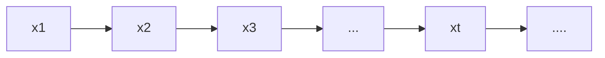

## Background

在概率图模型的推断过程中，当过程比较复杂时，需要进行大量的计算，这时候就需要使用一些近似推断的方法。

## Monte Carlo Method

蒙特卡洛方法是一种**基于随机采样**的数值计算方法，主要用于求解无法通过解析方法求解的问题。

### 近似求解圆周率

假设我们拥有一个能从$U(0,1)$中采样的方法，那么我们可以通过采样的方法来求解圆周率。


具体的方法为：我们可以通过一个正方形和一个内切圆，均匀分布落在圆内的概率为$P(A) = \frac{\pi}{4}$，**依据伯努利大数定律$\frac{1}{n} \sum_{i=1}^n \mathbb{I}_{A,i} \xrightarrow{P} P(A)$**，我们可以通过采样的方法来求解圆周率。

```python
import random
iters = 1000000

points = [(random.random(), random.random()) for _ in range(iters)]
inside = 0
for x,y in points:
    if x**2 + y**2 < 1:
        inside += 1

print("pi = ", 4 * inside / iters)
```

### Monte Carlo 数值积分

假设我们要求解一个函数$f(x)$的积分$\int_{a}^{b} f(x) \text{d}x$, 我们没有解析解，因此我们对形式处理一下。

$$
\int_{a}^{b} f(x) \text{d}x = \int_{a}^{b} \frac{f(x)}{p(x)} p(x) \text{d}x = \mathbb{E}_{p(x)}[\frac{f(x)}{p(x)}]
$$

其中要求$p(x)$是一个分布，即$p(x) \geq 0$，且$\int_{a}^b p(x) \text{d}x = 1$，我们可以通过采样的方法来求解积分。如果$p(x)$是一个均匀分布，那么我们可以通过均匀采样的方法来求解积分。

$$
\mathbb{E}_{p(x)}[\frac{f(x)}{p(x)}]
\approx \frac{1}{N} \sum_{i=1}^N \frac{f(x_i)}{p(x_i)}
$$

```python
# 求解y= x^2 + 1 在 [0,1] 上的定积分

iters = 1000000
total = 0
for _ in range(iters):
    x = random.random()
    total += x**2 + 1

print("integral = ", total / iters)
```

### Monte Carlo 采样方法

一种基于采样的随机近似方法，主要用途是数值积分。

而我们经常通过一个概率$p(Z|X)$，其中$Z$是我们 latent variable，$X$是 observed variable，来求取期望$\mathbb{E}_{Z|X}[f(Z)] = \int f(Z) p(Z|X) \text{d}Z$，此时可以使用 Monte Carlo 通过采样求积分, $\int f(Z) p(Z|X) \text{d}Z \approx \frac{1}{N} \sum f(Z_i)$, 那么问题就转化为了**如何从复杂分布中采样$Z_i$**。

#### 1. 概率分布采样

通过计算机能够产生一个$U(0,1)$的随机数，然后通过给定的 pdf $p(z)$获得 cdf，然后通过 cdf 的反函数得到采样。

假设我们有均匀分布的采样点$z \sim U(0,1)$，待采样的 pdf 为$p(x)$，cdf 为$F(x)$，那么我们可以通过$F^{-1}(z)$来获得采样点。

于是$X = F^{-1}(Z)$，要证明采样后的$X$的分布为$p(x)$，我们可以通过计算$F^{'}(x) = P(X \leq x) = P(F^{-1}(Z) \leq x) = P(Z \leq F(x)) = \int_{0}^{F(x)} 1 \text{ d} t = F(x)$，即$X$的 cdf 为$F(x)$，那么$X$的 pdf 为$p(x)$。

但是如果我们无法直接计算 cdf / cdf 的反函数，我们不能使用这种方法。

#### 2. 拒绝采样 (Rejection Sampling)

先指定一个 proposal distribution $q(z)$，使得 $M q(z) \geq p(z)$，其中 $M$ 是一个常数，指定接受率$\alpha=\frac{p(z_i)}{Mq(z_i)}$, 算法描述为：

a. 从 $q(z)$ 中采样 $z_i$
b. 在 0-1 均匀分布中采样 $u$
c. 如果 $u \leq \alpha$ 则接受 $z_i$，否则拒绝

即，我们其实知道$p(z_i)$在某一点的取值，但是我们不知道整体的分布，因此我们通过一个简单的分布$q(z)$来近似，然后通过接受率来判断是否接受。

那么采样得到$z_i$的概率$q(z_i)$, 保留$z_i$的概率为$p(accept | z_i) = \frac{p(z_i)}{M q(z_i)}$, 那么我们可以得到采样得到$z_i$的概率为$q(z_i) p(accept | z_i) = \frac{p(z_i)}{M}$，那么最后保留下来样本中，$z_i$的分布为$p(z_i | accept) = p(z_i)$。

```python
# 要从 p(x) 中采样
import math

def p(x):
    "Standard normal distribution"
    return math.exp(-x**2) / math.sqrt(2 * math.pi)

def accept(x,k):
    return p(x) / k

iters = 1000000
points = []
for _ in range(iters):
    x = random.uniform(-10, 10)
    u = random.random()
    if u < accept(x,1):
        points.append(x)

# 绘制直方图
plt.hist(points, bins=100, density=True)
plt.show()
```


#### 3. 重要性采样 (Importance Sampling)

$\mathbb{E}\_{ p(z) }[f(z)] = \int p(z) f(z) \text{d}z = \int \frac{p(z)}{q(z)} q(z) f(z) \text{d} z \approx \frac{1}{N}\sum f(z_i) \frac{p(z_i)}{q(z_i)} $

严重依赖于 q 的选择，如果 q 选择不当，会导致采样的效率很低。

#### 4. Sampling Importance Resampling (SIR)

## Markov Chain

随机过程研究的是一个随机变量序列，而马尔可夫链是一种特殊的随机过程。

马尔可夫链是一个事件和状态都是离散的，具有齐次$n$阶马尔可夫性的随机过程，即给定现在的状态，未来的状态与过去的状态无关。
1 阶 Markov Chain：$p(x_t | x_{t-1}, x_{t-2}, \dots, x_1) = p(x_t | x_{t-1})$

我们定义转移矩阵$p_{ij} = p(x_{t+1} = j | x_t = i)$

以概率图模型表示，即为



$t$时刻状态的$x$取值可以由$t-1$时刻的状态+转移概率求边缘概率得到。

**平稳分布**：$\pi = \pi P$，其中$\pi$是一个行向量，$P$是转移矩阵，$\pi$是一个平稳分布，即$\pi = \pi P = \pi P^2 = \dots$，也可以表示为$\pi(i) = \sum_j \pi(j) p_{ji}$

**Detailed balance condition**：$\pi(i) p_{ij} = \pi(j) p_{ji}$

$\text{Detailed balance condition} \Rightarrow \text{Balance Distribution}$

> Proof

$$
\sum_j \pi(j) p_{ji} = \sum_j \pi(i) p_{ij} =  \pi(i) \sum_j p_{ij} = \pi(i)
$$

假如我们能够构造一个马尔可夫链，使得其平稳分布为我们要求的分布，那么我们就可以通过马尔可夫链的采样来获得我们要求的分布。

## MH Algorithm

主要思想：从一个 Markov Chain 中不断地采样，使得其平稳分布为我们要求的分布。

我们需要构造转移矩阵，使得其平稳分布为我们要求的分布。但是不能直接构造出这样的矩阵，但是通过 detailed balance condition 可以构造平稳分布，因此我们先构造一个提议分布$Q(x^\star | x^{t-1})$，然后通过构造一个接受率来使得满足以下条件：

$$
p(x^{t-1}) Q(x^\star | x^{t-1}) A(x^\star| x^{t-1}) = p(x^\star) Q(x^{t-1} | x^\star) A(x^{t-1} | x^\star)
$$

如果我们定义接受率为$A(x^\star| x^{t-1}) =\min(1, \frac{p(x^\star) Q(x^{t-1} | x^\star)}{p(x^{t-1}) Q(x^\star | x^{t-1})}$) ，那么上述等式就可以满足 detailed balance condition。

> Proof

那么上述等式左边即可被表示为：

$$
p(x^{t-1}) Q(x^\star | x^{t-1}) A(x^\star| x^{t-1}) = \\
p(x^{t-1}) Q(x^\star | x^{t-1}) \min(1, \frac{p(x^\star) Q(x^{t-1} | x^\star)}{p(x^{t-1}) Q(x^\star | x^{t-1})} )= \\
\min(p(x^{t-1}) Q(x^\star | x^{t-1}), p(x^\star) Q(x^{t-1} | x^\star)) = \\
p(x^{t-1}) Q(x^\star | x^{t-1}) \min(1, \frac{p(x^\star) Q(x^{t-1} | x^\star)}{p(x^{t-1}) Q(x^\star | x^{t-1})} ) = \\
p(x^\star) Q(x^{t-1} | x^\star) A(x^{t-1} | x^\star)
$$

即我们可以通过构造一个接受率为$A(x^\star| x^{t-1}) =\min(1, \frac{p(x^\star) Q(x^{t-1} | x^\star)}{p(x^{t-1}) Q(x^\star | x^{t-1})}$)的转移矩阵，使得其平稳分布为我们要求的分布。

> End Proof

那么根据拒绝采样的思想，我们可以通过一个简单的分布$q(x)$来近似$p(x)$，然后通过接受率来判断是否接受。

**这里的接受率在算法当中是怎么计算出来的？**
