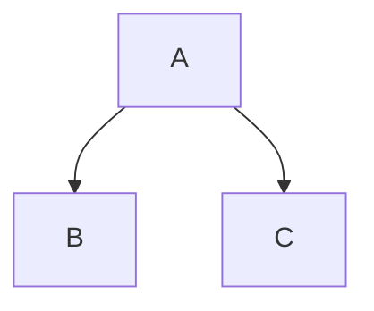
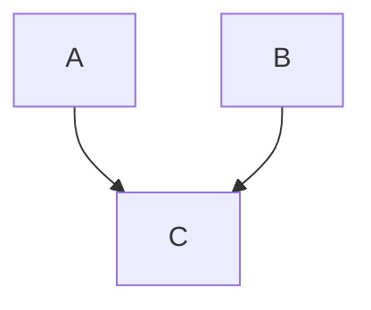
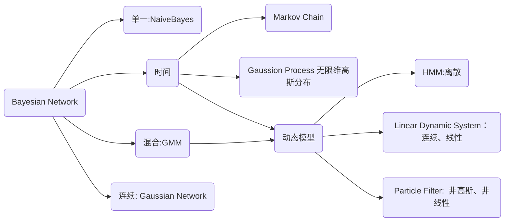
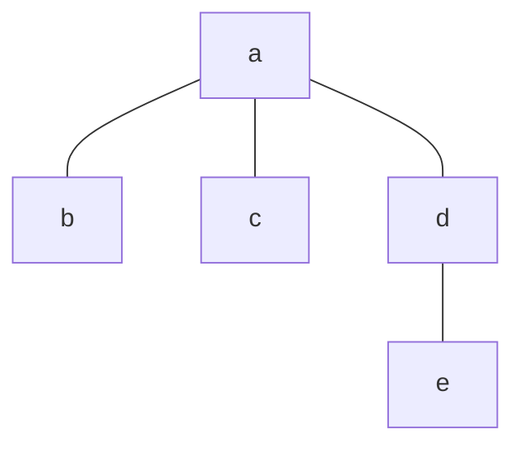
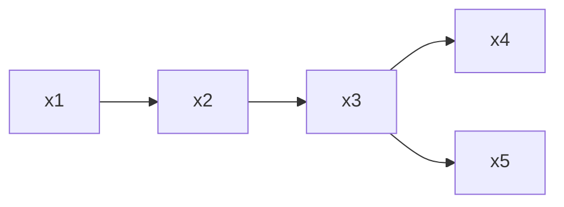

## 1. 概念

**概率**：概率模型关心的是一个多维的概率分布

**图**：即图论的图，起的作用为一个工具，直观表达概率之间的联系，将概率嵌入图中，使得模型更加直观，可以将概率模型的特征明显表示出来。

对于多维随机变量$p(x_1, \dots, x_p)$, 常用计算为求边缘概率与条件概率，即有如下运算

1. Sum Rule
   $$
   p(x_1) = \int_{x_2} \dots \int_{x_p} p(x_1, \dots, x_p) dx_2 \dots dx_p
   $$
2. Product Rule
   $$
   p(x_1|x_2) = \frac{p(x_1, x_2)}{p(x_2)}
   $$
3. Chain Rule
   $$
   p(x_1, \dots, x_p) = p(x_1) p(x_2|x_1) \dots p(x_p|x_1, \dots, x_{p-1})
   $$
4. Bayes' Rule
   $$
   p(x_1|x_2) = \frac{p(x_2|x_1)p(x_1)}{p(x_2)} = \frac{p(x_2|x_1)p(x_1)}{\int p(x_2|x_1)p(x_1)dx_1}
   $$

**困境**：对于多维随机变量，计算$p(x_1, \dots, x_p)$计算量太大，要简化计算

**简化 1**：每个随机变量之间相互独立，即有$p(x_1, \dots, x_p) = \prod_{i=1}^{p} p(x_i)$

- Naive Bayes 假设所有特征之间**条件独立**，即有$p(x_1, \dots, x_p|y) = \prod_{i=1}^{p} p(x_i|y)$

**简化 2（Markov Property）**：给定当前状态，未来状态与过去状态无关，即有$p(x_k | x_1, \dots x_{k-1},x_{k+1},\dots, x_{p}) = p(x_k | x_{k-1})$

- HMM 隐马尔科夫模型，使用齐次马尔可夫假设

**简化 3（条件独立性假设）**：给定隐变量，观测变量之间相互独立，即有$p(x_1, \dots, x_p|z) = \prod_{i=1}^{p} p(x_i|z)$，是马尔可夫性质的推广

- Representation
  - 有向图 Bayesian Network
  - 无向图 Markov Network
  - 高斯图 Gaussian Network(BN MN)
- Inference(给定已知数据，求另外的概率分布)
  - Exact Inference：使用 DP 计算联合分布
  - Approximate Inference
    - 确定性近似（变分推断）
    - 随机近似 MCMC
- Learning
  - Parameter Learning
    - 完备数据
    - 隐变量
  - Structure Learning

## 2. Bayesian Network（有向图模型）

使用条件独立性，将联合概率分解为多个条件概率的乘积，即有

$$
p(x_1, \dots, x_p) = p(x_1)\prod_{i=2}^{p} p(x_i | x_{i-1})
$$

### 因子分解

构建图，使用**Topological Order**，若有$X \rightarrow Y$，则有$p(Y|X)$，那么从图上即可以得到联合概率分布。

### Local Structure

注意，接下来的情况是规律，是从图与概率的关系得出的。

1. tail to tail
   若有三个随机变量$A, B, C$满足 chain rule，即$p(A,B.C) = p(A) p(B|A) p(C|A,B)$，同时有如下图



根据图写出关系，有$p(A,B,C) = p(A) p(B|A) p(C|A)$
则有$p(C|A,B) = p(C|A)$，其中$p(C|A,B) = \frac{p(B,C|A)}{P(B|A)}$
表明$C$与$B$条件独立。

2. head to tail


$A$ 与 $C$ 在 $B$ 条件下独立，即$p(C|A,B) = p(C|B)$

3. head to head



默认情况下，$A$ 独立于 $B$
若$C$被观测，$A$ 与 $B$ 有关系。

$$
p(A,B,C) = p(A) p(B) p(C|A,B) = p(A) p(B|A) p(C|A,B)
$$

可得默认情况下，$A$ 与 $B$ 独立。

### Representation: D - Separation

在图中判断节点集合的条件独立性，使用 D-separation 规则。


D-separation 有两个规则

1. 若有节点$x_b$作为跨点连接$A$与$C$，并形成 head to tail 或者 tail to tail 结构，那么$x_b$ 一定在$B$集合中
2. 若有节点$x_b$作为跨点连接$A$与$C$，并形成 head to head 结构，那么$x_b$ 一定不在$B$集合中

依次检测所有跨点，若都满足，那么$A$ 与 $C$ 条件独立。

这种判断规则也叫**全局马尔可夫性**。

### Representation: Sample




从单一到混合、从有限到无限：
空间：随机变量的取值从离散到连续
时间：时间序列模型从有限到无限，从某一时刻延长到无限时间

- Naive Bayes
  贝叶斯网络最简单的模型

  ```mermaid
      graph TD
          y --> x1
          y --> x2
          y --> x3
  ```

- GMM

  ```mermaid
      graph LR
          z --> x
  ```

  其中 $z$ 是离散的，$x|z \to \mathcal{N}$

## 3. Markov Random Field（无向图模型）

### 条件独立性

条件独立性体现在以下三个方面，且能**互相推出**：

**无向图的全局马尔可夫性**：给定两个随机变量集合的分离集，两个随机变量集合之间条件独立。

**局部马尔可夫性**：



$a \perp (全集 - a - \text{neighbour of a}) | \text{neighbour of a}$

**成对马尔可夫性**:

$x_i \perp x_j | x_{-i-j}$ 其中$x_i,x_j$不能相邻

### 因子分解

无向图在因子分解时没有明确的方向性，因此要有额外的考虑

需要引入概念：

1. **团**：关于节点的集合，团中的节点形成一个完全图（所有的节点之间都有边）
2. **极大团**：团中不能再加入其他节点形成团(return 极大团是一个 NP-hard 问题)

**团分解**：将联合概率分解为多个团的势函数乘积

所有团的集合记为$C$, 与团$c$对应的变量集合$x_c$,势函数$\psi_c(x_c) \geq 0$

$$
p(x_1, \dots, x_p) = \frac{1}{Z} \prod_{c \in C} \psi_c(x_c)
$$

其中 Z 是归一化因子，使得概率和为 1,$Z = \sum_x \prod_{c \in C} \psi_c(x_c)$

_Mark: $\psi_c(x_c)$取值随着 x_c 中的 x 取值改变而改变_

然而，当变量个数较多时，团的数量会很多，因此需要简化，注意到团被极大团包含，因此可以使用极大团来简化。$C^*$为极大团的集合。

$$
p(x_1, \dots, x_p) = \frac{1}{Z} \prod_{c \in C^*} \psi_c(x_c)
$$

接下来的问题时如何构建势函数，使得因子分解与条件独立性一致。

### Hammesley-Clifford 定理

如果联合概率分布能够使用极大团势函数表示，那么由该定理可以证明，**因子分解与条件独立性的三个性质等价**。

### 如何使用因子分解

为了满足非负性，我们一般定义势函数（Gibbs Distribution）

$$
\psi_Q(x_Q) = \exp(-H_Q(x_Q))
$$

那么此时，联合概率分布为

$$
p(x_1, \dots, x_p) = \frac{1}{Z} \prod_{c \in C^*} \psi_c(x_c) = \frac{1}{Z} \prod_{c \in C^*} \exp(-H_c(x_c)) =  \underbrace{\frac{1}{Z} \exp(-\sum_{c \in C^*} H_c(x_c))}_{\text{指数族分布}}
$$

经过一通乱七八糟的说明之后，我们可以得知，Markov Random Field 与 Gibbs Distribution 是等价的。

## 4. Inference

总体来讲，Inference 是指求解已知数据的概率，而求已知数据的概率时需要模型的参数，但是如果将参数看作未知的变量，那么学习的过程也可以被看作是 Inference 的过程。

Inference 主要分为两类：

1. $p(x_E)$
2. $p(x_F | x_E)$, 而 $p(x_F | x_E)$又可以被写作

$$
p(x_F | x_E) = \frac{p(x_F, x_E)}{p(x_E)}
$$

3. MAP: $\arg \max_{x_F} p(x_F | x_E)$

实际上 Inference 过程最主要的问题就是求解边缘分布的过程。

- 精确推断
  - 动态规划/变量消除/Variable Elimination
  - 信念传播/Belief Propagation
  - Junction Tree
- 近似推断
  - 确定性近似：变分推断
  - 随机近似：MCMC

### Variable Elimination



$x_5$的边缘概率分布求解为

$$
P(x_5) = \sum_{x_1} \sum_{x_2} \sum_{x_3} \sum_{x_4} P(x_1, x_2, x_3, x_4, x_5)
$$

$$
= \sum_{x_1} \sum_{x_2} \sum_{x_3} \sum_{x_4} P(x_1) P(x_2 | x_1) P(x_3 | x_2) P(x_4 | x_3) P(x_5 | x_3) = \\
\sum_{x_3} P(x_5 | x_3) \sum_{x_4} P(x_4 | x_3) \sum_{x_2} P(x_3 | x_2) \sum_{x_1} P(x_2 | x_1) P(x_1)
$$

_曾经在 C 语言课上解释过最好先加再乘，因为乘法比加法慢_

可以定义中间函数，减少重复计算的结果：

$$
m_{12}(x_2) = \sum_{x_1} P(x_2 | x_1) P(x_1) \\
m_{23}(x_3) = \sum_{x_2} P(x_3 | x_2) m_{12}(x_2) \dots
$$

对于无向图，我们也可以使用 Variable Elimination 的方式进行推断。

$$
P(x_5) = \sum_{x_1} \sum_{x_2} \sum_{x_3} \sum_{x_4} P(x_1, x_2, x_3, x_4, x_5) \\
= \sum_{x_1} \sum_{x_2} \sum_{x_3} \sum_{x_4} \psi_1(x_1, x_2) \psi_2(x_2, x_3) \psi_3(x_3, x_4) \psi_4(x_3, x_5) \\
= \sum_{x_3} \psi_4(x_3, x_5) \sum_{x_4} \psi_3(x_3, x_4) \sum_{x_2} \psi_2(x_2, x_3) \sum_{x_1} \psi_1(x_1, x_2) = \\
\sum_{x_3} \psi_4(x_3, x_5) \sum_{x_4} \psi_3(x_3, x_4) m_{23}(x_3) \sum_{x_1} \psi_1(x_1, x_2) m_{12}(x_2)
$$

### Belief Propagation

对无向图进行推断，使用消息传递的方式，将消息传递给邻居节点。与上述过程类似


```{C++}
for x_i in NB(x_j)
    collect message of x_i;
    send message to x_j;
```

就是图的遍历，对于无向图，我们可以使用这种方式进行推断。
